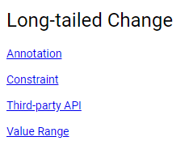
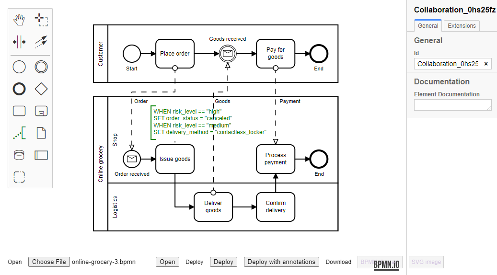
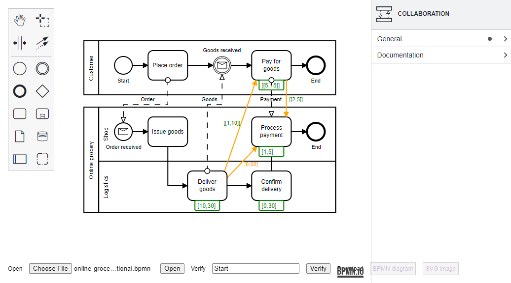
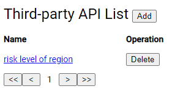
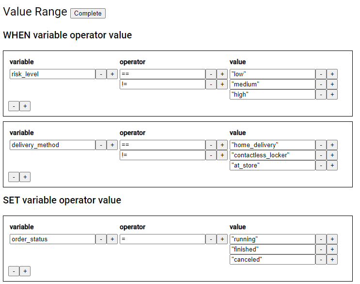

# Reaction to Long-tailed Change

## Introduction

This  project supports the reaction to long-tailed changes of business processes. This project adopts the separation of concerns (SoC) principle.

A front-line person can

- annotate a business process model with domain-specific language (DSL), in order to intervene in the behavior of the business process;

- bind third-party APIs, in order to query information.

A back-end person can

- specify functional and non-functional (temporal) constraints on a business process model, in order to make the reaction to long-tailed changes comply with business regulations;

- specify the value ranges of the process variables in a business process model.

Our tool can

- convert a process model  annotated with DSL into an ordinary process model, so that an existing process engine (e.g., Camunda) can execute it;

- verify whether a process model still meets functional and non-functional constraints after the reaction to long-tailed changes.

## Run

First, run subproject `engine-backend`. It is a process engine powered by Camunda. The process engine can be accessed at http://localhost:8082/ . The default user is admin/admin.

Then, run subproject `compiler-backend`. It is our tool to convert process models and verify functional and non-functional constraints.

Next, run subproject `dsl-frontend`. It is the front end of our tool. Our tool can be accessed at http://localhost:8093/ .

This is the homepage of our tool:

`Annotation` is for a front-line person to annotate a process model:

- Open a process model. Click `Choose File` to choose a .bpmn file and click `Open` to open the process model.

- Add a text annotattion. Choose an activity and click  to add a text annotation.

- Write a DSL code. Use buttons and drop-down menus to write a DSL code.

- Deploy the process model. Click `Deploy with annotation` to deploy the annotated process model. An example is `process-example/online-grocery-annotation.bpmn`.

`Constraint` is for a back-end person to specify functional and non-functional constraints on a process model:

- Open a process model. Click `Choose File` to choose a .bpmn file and click `Open` to open the process model.

- Specify a functional constraint. Draw a link between two activities and set the relation in the property panel. An example is `process-example/online-grocery-functional.bpmn`.

- Specify a non-functional constraint. Choose an activity and set the duration in the property panel. Draw a link between two activities and set the constraint in the property panel. An example is `process-example/online-grocery-non-functional.bpmn`.

- Verify the constraints. Set the start node name and click `Verify`.

`Third-party API` is for a front-line person to bind third-party APIs:

`Value Range` is for a back-end person to specify the value ranges of the process variables in a process model:

